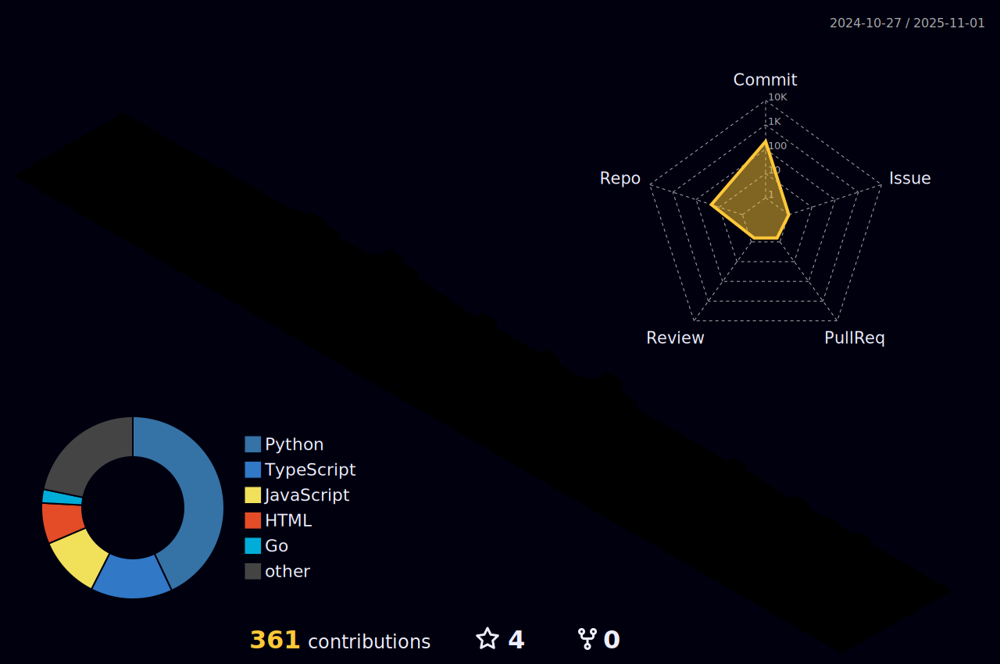

- I am currently pursuing a Bachelor’s degree in Information Systems at the Federal Fluminense University (UFF)
- How to reach me: [danilomoura.site](https://www.danilomoura.site)
- Building a career grounded in problem-solving and continuous learning

#### <i>Connect with me</i>: 
 
 

 

  
 <b> Some stats </b> <i>(Click to expand)</i> 

   
  
  

